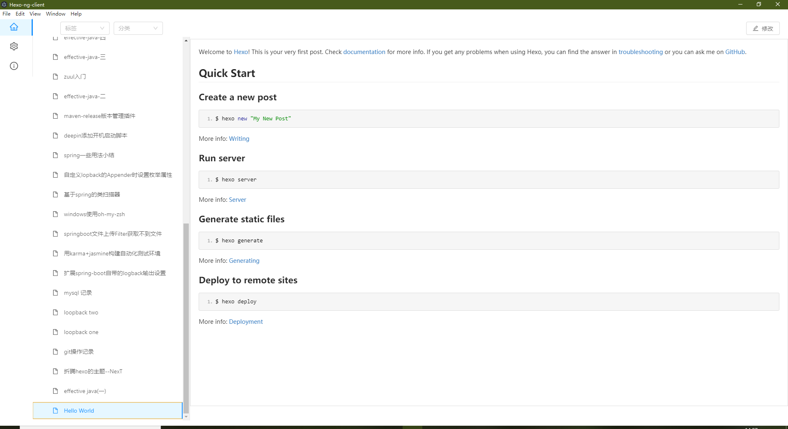
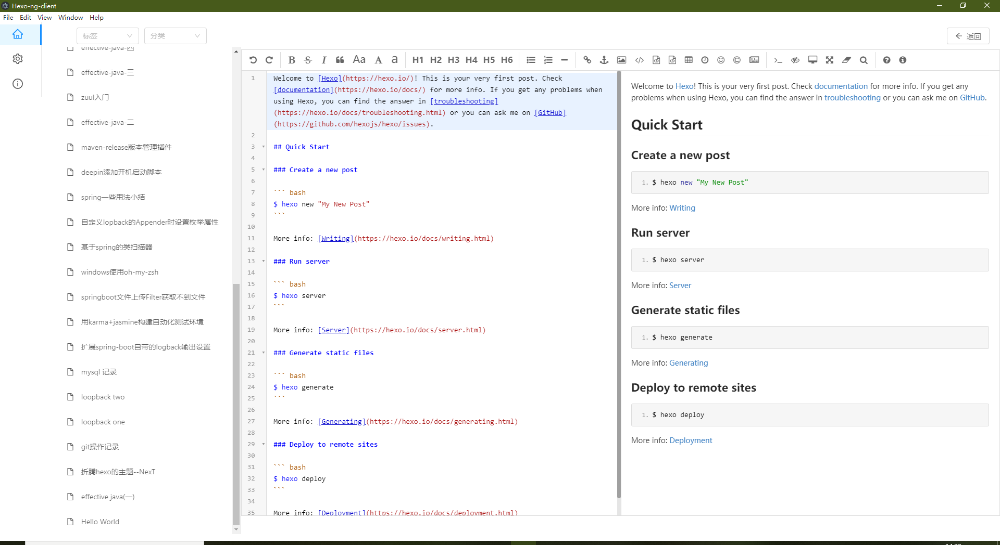

# Hexo-ng-client

> hexo 的编辑器 使用 angular + NG-ZORRO   构建

使用:
- angular
- NG-ZORRO 
- angular-electron
- typescript
- electron
- electron-builder

## 已知问题
 
- 在编辑界面同步预览时预览界面无法加载: (在工具栏手动关闭/打开预览)
- 在编辑界面同步预览时预览界面样式错误: (点击全窗口预览再关闭全窗口预览即可恢复正确同步预览)

## demo

  
